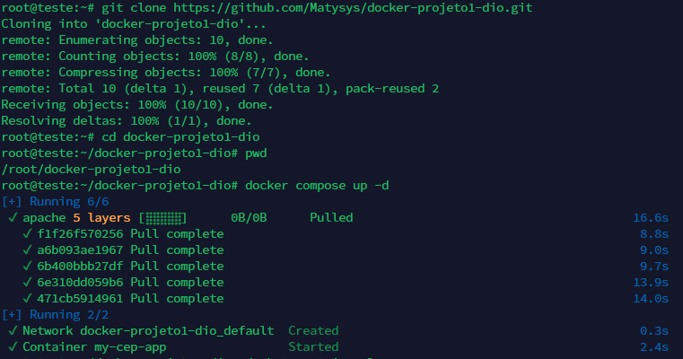

# Colocando uma pequena aplicação web para funcionar dentro de um container utilizando Docker Composer

Aplicação simples que consome a API do ViaCep com a biblioteca Axios e mostra a rua/avenida, cidade e UF abaixo. A aplicação tem uma validação bem simples do cep, mas não é o foco desse projeto.

### Clonando o repositório, adquirindo os requisitos necessários para a aplicação via .yml e iniciando o container

### Listando containers

### Aplicação no ar com o uso da Virtual Machine (Always to Free) da Oracle

